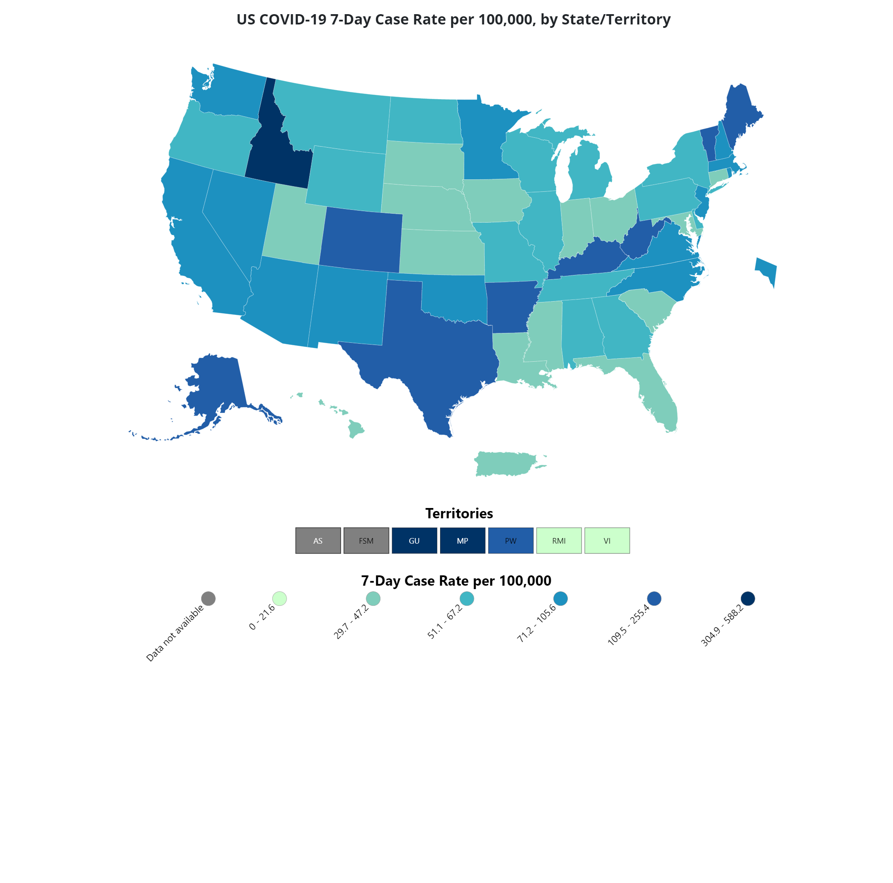
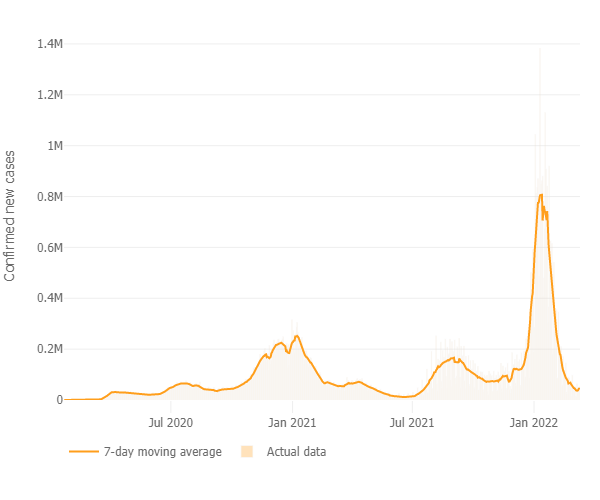

# 1.  Background

The global spread of COVID-19 has an obvious impact on the international pattern, especially on the contrast of the strength of big countries. The international image and strategic reputation of the United States have been damaged, and its leadership in international affairs has been reduced. The intensified strategic competition between China and the United States has complicated the mentality of European countries towards China and the United States International organizations have been significantly impacted, global governance is facing greater challenges, and the importance of non-traditional security in international security has increased relatively. Therefore, it is very important to study the effect of vaccine among different ages in preventing the impact of virus on human body. 

```{r, echo=FALSE , out.width = '80%'}

```

According to the heat map, the overall rate of infection in the United States remains high.

```{r , echo=FALSE, out.width = '80%'}

```

According to the case trend, there is an obvious outburst in Jan 2022 and this may be due to the Omicron variant. The emergence of virus variants can greatly affect the effectiveness and     mortality of vaccines, so it is necessary to study the relevant data of vaccines.


# 2.  Introduction 

**Question of interest:**
The project aims at exploring what are the factor(s) correlated with infections and death rate of COVID-19 to help protecting people from infection.

The dataset contains rates of COVID-19 Cases or Deaths by Age Group and Vaccination Status
It can be achieved from the website: <https://data.cdc.gov/Public-Health-Surveillance/Rates-of-COVID-19-Cases-or-Deaths-by-Age-Group-and/3rge-nu2a>

Main variables we are interested in:

* **1. Month:**                      Calendar month corresponding to MMWR week value(JAN - DEC)

* **2. Age groups:**                 12-17 years; 18-29 years; 30-49 years; 50-64 years; 65-79 years; 80+ years

* **3. Vaccinated with outcome:**    Weekly count of vaccinated individuals with the corresponding outcome

* **4. fully_vaccinated_population:** the total number of fully vaccinated population in age group this week

* **5. unvaccinated_with_outcome:** newly increased number of cases from unvaccinated population in this age group this week

* **6. outcome:** the type of outcome: infection or death

* **7. vaccine_product:** Janssen; Moderna; Pfizer; all_types (includes Janssen, Moderna, Pfizer and unknown, FDA-approved vaccine product types)


# 3.  Exploratory data analysis

```{r setup, include=FALSE}
knitr::opts_chunk$set(warning = FALSE, message = FALSE)
```


```{r echo=FALSE}
#library(tidyverse)
library(readxl)
library(gplots)
library(lme4)
library(GGally) 
library(ggpubr)
library(ggplot2)
library(ggthemes)
library(knitr)
library(stargazer)
library(kableExtra)
library(dplyr)
```


```{r echo=FALSE}
da=read_excel("weekly.xlsx", sheet = "all")
case_vac = read_excel("weekly.xlsx", sheet = "case_vaccine")    # Only contains case ignoring vaccine brand
death_vac = read_excel("weekly.xlsx", sheet = "death_vaccine")
case_brand = read_excel("weekly.xlsx", sheet = "case_brand")
```

```{r echo=FALSE}
death_vac$death_rate_vac = death_vac$vaccinated_with_outcome/death_vac$fully_vaccinated_population
death_vac$death_rate_unvac = death_vac$unvaccinated_with_outcome/death_vac$unvaccinated_population
case1 = data.frame(death_vac$age_group,death_vac$death_rate_vac)
case1$status = "vaccinated"
colnames(case1) = c("age_group","death_rate","status")
case2 = data.frame(death_vac$age_group,death_vac$death_rate_unvac)
case2$status = "unvaccinated"
colnames(case2) = c("age_group","death_rate","status")
covid_age_d = rbind(case1,case2)
covid_age_d$age_group = as.factor(covid_age_d$age_group)
covid_age_d$status = as.factor(covid_age_d$status)
```

```{r echo=FALSE}
case_vac$case_rate_vac = case_vac$vaccinated_with_outcome/case_vac$fully_vaccinated_population
case_vac$case_rate_unvac = case_vac$unvaccinated_with_outcome/case_vac$unvaccinated_population
case1 = data.frame(case_vac$age_group,case_vac$case_rate_vac)
case1$status = "vaccinated"
colnames(case1) = c("age_group","case_rate","status")
case2 = data.frame(case_vac$age_group,case_vac$case_rate_unvac)
case2$status = "unvaccinated"
colnames(case2) = c("age_group","case_rate","status")
covid_age = rbind(case1,case2)
covid_age$age_group = as.factor(covid_age$age_group)
covid_age$status = as.factor(covid_age$status)
```

Let's first check the age groups.

```{r echo=FALSE}
ggplot(data= covid_age, mapping=aes(x="",fill=age_group)) + geom_bar(width = 1,stat = "count") + coord_polar("y")+scale_fill_brewer(palette="Blues")+
  theme_minimal()+
  ggtitle("Age group") +
  theme(plot.title = element_text(hjust = 0.5))
```

We can see the age group distributed evenly, so we should keep all data without processing.

```{r echo=FALSE}
ggplot(data= case_brand, mapping=aes(x="",fill=vaccine_product
)) + geom_bar(width = 1,stat = "count") + coord_polar("y")+scale_fill_brewer(palette="Blues")+
  theme_minimal()+
  ggtitle("") +
  theme(plot.title = element_text(hjust = 0.5))
```

The sources of vaccine products are also well-balanced. However, different vaccine products have different definitions of complete vaccination. The Janssen vaccine requires only one shot to be fully vaccinated, some with two shots, some with booster shots. Therefore, in our data set, the brand of vaccine could not be used as an influencing factor.  

```{r echo=FALSE}
hist_case_rate = ggplot(data = case_vac,aes(x = vaccinated_with_outcome
)) + 
  geom_histogram(aes(y=..density..),fill='#BEEDC7',alpha=0.8,bins = 40)+
  geom_density(size = 1.0)+
  theme(panel.background = element_blank())+
  ggtitle("Case Rate") +
  theme(plot.title = element_text(hjust = 0.5))
hist_death_rate = ggplot(data = death_vac,aes(x = vaccinated_with_outcome
)) + 
  geom_histogram(aes(y=..density..),fill='#BEEDC7',alpha=0.8,bins = 40)+
  geom_density(size = 1.0)+
  theme(panel.background = element_blank())+
  ggtitle("Death Rate") +
  theme(plot.title = element_text(hjust = 0.5))
hist_case_rate_u = ggplot(data = case_vac,aes(x = unvaccinated_with_outcome
)) + 
  geom_histogram(aes(y=..density..),fill='#BEEDC7',alpha=0.8,bins = 40)+
  geom_density(size = 1.0)+
  theme(panel.background = element_blank())+
  ggtitle("Case Rate") +
  theme(plot.title = element_text(hjust = 0.5))
hist_death_rate_u = ggplot(data = death_vac,aes(x = unvaccinated_with_outcome
)) + 
  geom_histogram(aes(y=..density..),fill='#BEEDC7',alpha=0.8,bins = 40)+
  geom_density(size = 1.0)+
  theme(panel.background = element_blank())+
  ggtitle("Death Rate") +
  theme(plot.title = element_text(hjust = 0.5))
ggarrange(hist_case_rate,hist_death_rate,hist_case_rate_u,hist_death_rate_u)
```

Infection rate and death rate showed similar trends. So in our experiment, we should ignore the influence of time.  

According to the histogram, the distribution of case rate and death rate under two vaccination status is alike and it is all right-skewed. As a result, we need to do a log-transformation to both rates.

```{r echo=FALSE}
covid_age$log_case_rate = log(covid_age$case_rate)
covid_age_d$log_death_rate = log(covid_age_d$death_rate)

hist_lcase_rate = ggplot(data = covid_age,aes(x = log_case_rate)) + 
  geom_histogram(aes(y=..density..),fill='#BEEDC7',alpha=0.8,bins = 40)+
  geom_density(size = 1.0)+
  theme(panel.background = element_blank())+
  ggtitle("Log Case Rate") +
  theme(plot.title = element_text(hjust = 0.5))

hist_ldeath_rate = ggplot(data = covid_age_d,aes(x = log_death_rate)) + 
  geom_histogram(aes(y=..density..),fill='#BEEDC7',alpha=0.8,bins = 40)+
  geom_density(size = 1.0)+
  theme(panel.background = element_blank())+
  ggtitle("Log Death Rate") +
  theme(plot.title = element_text(hjust = 0.5))

ggarrange(hist_lcase_rate,hist_ldeath_rate)
```

We can see the distribution plot is better after the log transformation meaning they tend to follow a normal distribution.

Based on these plots, We decide to split the data that patients are divided into two vaccination status: vaccinated or unvaccinated, then count its corresponding case(infection)/death rate and death rate. Now we have two new datasets, one of which looks like:   

```{r echo=FALSE}
knitr::kable(head(covid_age),'simple')
```


```{r echo=FALSE}
box_case_age = ggplot(data = covid_age,aes(age_group,case_rate)) + geom_boxplot(fill = c(2:7)) +
  theme_classic() +  xlab("age") +
  ggtitle("Case rate v.s Age")

box_death_age = ggplot(data = covid_age_d,aes(age_group,death_rate)) + geom_boxplot(fill = c(2:7)) +
  theme_classic() +  xlab("age") +
  ggtitle("Death rate v.s Age")

ggarrange(box_case_age,box_death_age)
```

According to the boxplots, it seems the infection rate and death rate distributed different in age groups. The infection rate seems to be similar regardless of age.


```{r echo=FALSE}
box_death_status = ggplot(data = covid_age_d,aes(status,death_rate)) + geom_boxplot(fill = c(2:3)) +
  theme_classic() +  xlab("Status") +
  ggtitle("Death rate v.s Status")

box_case_status = ggplot(data = covid_age,aes(status,case_rate)) + geom_boxplot(fill = c(2:3)) +
  theme_classic() +  xlab("Status") +
  ggtitle("Case rate v.s Status")

ggarrange(box_case_status,box_death_status)
```

Both the infection rate and death rate varies significantly between vaccinated and unvaccinated people.


# 4. Model assumptions

We tend to use two way anova model to test whether different age groups have different incidence rate.  

Since each week is as an observation which contains both status of vaccination(vaccinated or unvaccinated) and all age groups. Therefore, this experiment is a balanced design.

Model: 

$$Y_{ijk} = \mu_{..} + \alpha_{i} + \beta_{j} + +(\alpha\beta)_{ij} + \epsilon_{ijk}$$, where the index $i$ represents the vaccination status: unvaccinated ($i=1$), vaccinated ($i=2$), and the index $j$ represents different age groups, $12-17(j=1), 18-29(j=2), 30-49(j=3), 50-64(j=4), 65-79(j=5), 80+(j=6)$, and $\epsilon_{ijk} \ {iid \atop \widetilde{}} \ N(0, \sigma^2)$

where
$$\mu_{\cdot \cdot} =\sum_{i=1}^a \sum_{j=1}^ b \mu_{ij}/(ab), \ \mu_{i\cdot} = \sum_{j=1}^b \mu_{ij} /b, \ \mu_{\cdot j}=\sum_{i=1}^a \mu_{ij}/a.$$

$$\{\mu_{ij}:i =1,\ldots, a, j=1,\ldots, b\}$$  is the population mean of each cell

There are natural constraints:
$$\sum \alpha_{i}  = \sum \beta_{j}=0 $$
and
$$\sum_{i=1}^a (\alpha\beta)_{ij}  =\sum_{j=1}^b (\alpha\beta)_{ij} = 0$$

Now we check the main effect plots for potential interactions.

```{r echo=FALSE}
par(mfrow=c(2,2))
# Main effect plot for age group
plotmeans(case_rate ~ age_group,data = covid_age,xlab="Type",ylab="Case Rate", main="Main effect, Age group") 

# Main effect plot for status
plotmeans(case_rate ~ status,data=covid_age,xlab="Occupation",ylab="Wage", main="Main effect, Status") 

#Interaction plot
interaction.plot(covid_age$status, covid_age$age_group, covid_age$case_rate
                ,cex.lab=1.5,ylab="Relief",xlab='Status')
# par(mfrow=c(1,1))
```

According to the main effect plots, it seems that there are not many interaction effects.

In order to know whether we want to use a two way ANOVA with or without interaction effects, we need to conduct a test.
In order to decide whether age and interaction terms should be contained in this model, we make a hypotheses under confidence level α=0.01: 
$$H_0: (\alpha\beta)_{ij}=0 \  \forall i, j  \ \ {\rm v.s.} \ \ \ H_a:\  {\rm not \ all \ } (\alpha\beta)_{ij} \ {\rm are \ zero} $$

```{r echo=FALSE}
# test for interactions
full_model = lm(log_case_rate ~ age_group + status + age_group*status ,data = covid_age)
reduced_model = lm(log_case_rate ~ age_group + status ,data = covid_age)
```

```{r echo=FALSE}
knitr::kable(anova(reduced_model,full_model),"simple")
```

the p value is 0.07689>0.01, thus we fail to reject the null hypothesis, which means we can drop the interaction term.

# 5. Model fitting and inference
We fit two way anova for both infection rate and death rate.

```{r echo=FALSE}
two.way_case = aov(data = covid_age,log_case_rate~ status + age_group)
two.way_death = aov(data = covid_age_d,death_rate~ status + age_group)
```


```{r echo=FALSE}
summary(two.way_case)
```

We can tell that for the infection rate,the p value of age < 2e-16 and status = 0.0345 meaning they are both significant.

```{r echo=FALSE}
summary(two.way_death)
```

As for the death rate, the p value of age and status both <2e-16 meaning they are really significant. As a result, vaccination status and age have a powerful influence on death rates.  

Comparing to the death rate model, the age group factor is not that significant. In order to explore more about the relationship, we perform Tukey’s test under confidence level $\alpha=0.1$ on infection rate.

```{r echo=FALSE}
T.ci=TukeyHSD(two.way_case,"age_group", conf.level = 0.99)
T.ci$age_group %>%
  kbl(caption = "Coefficients Diff among Age group") %>%
  kable_classic_2(full_width = F, html_font = "Times New Roman")
```

```{r echo=FALSE}
T.ci=TukeyHSD(two.way_case,conf.level = 0.99)
par(mfrow=c(2,2))
plot(T.ci, las=1 , col="brown")
par(mfrow=c(1,1))
```

the age groups 30-49 vs 12-17, 18-29 vs 12-17 have the highest difference level.


# 6.  Sensitivity analysis


```{r echo=FALSE}
residuals_c = two.way_case$residuals
par(mfrow = c(1,2))
plot(two.way_case,which = 1)
qqnorm(residuals_c);qqline(residuals_c)
```

```{r echo=FALSE}
residuals_d = two.way_death$residuals
par(mfrow = c(1,2))
plot(two.way_death,which = 1)
qqnorm(residuals_d);qqline(residuals_d)
```

According to the plots, we can find that the model follows the equal variance and normal assumptions. We don’t find non-linear patterns in both residual plots.  


# 7.  Causal inference
Unfortunately, causal inference cannot be applied to our dataset. we can only regard “vaccination” as our treatment effect and it has outcome whether an individual is vaccinated(= 1) or not vaccinated(= 0). However, we do not know the 'real' number of cases because some of the cases may be infected multiple times. So we can not make any estimations related to infection. 
In addition,  the vaccination is randomized, meaning that we can not control people under the same risk of infection. The only covariable available in the data set is age group, however this clearly does not make sense. For example, if we want to apply causal inference, our covariable should definitely be daily habits instead of age.  

# 8.  Conclusion 

One important assumption in the report is that we omit the impact of time because the infection rate and death rate have the similar trend among time from different age group or vaccination group. Under this assumption, the vaccinated people had lower infection rate and death rate than the unvaccinated people and different age groups seems not having difference in infection rate but there is a marked difference in death rate. After applying two-way anova model and test, we found that vaccination status and age groups are both significant to infection rate and death rate. As a result, getting vaccination is essential for individuals to confront the risk of infection and death. On this basis, people with senior age(65+) need to do a better job of daily protection.

# Acknowlegement
My thoughts are inspired by the discussion with our group members: Chenyang Zhang, Sihong Fan and Yichao Zhang. 

# Reference
[1] Centers for Disease Control and Prevention. (n.d.). Rates of covid-19 cases or deaths by age group and vaccination status. Centers for Disease Control and Prevention. Retrieved March 3, 2022, from <https://data.cdc.gov/Public-Health-Surveillance/Rates-of-COVID-19-Cases-or-Deaths-by-Age-Group-and/3rge-nu2a>

[2] Johns Hopkins University. (n.d.). Biweekly confirmed COVID-19 cases per million people. Retrieved March 5,2022 from <https://ourworldindata.org/grapher/biweekly-covid-cases-per-million-people>

[3] CDC Government, United States COVID-19 Cases, Deaths, and Laboratory Testing (NAATs) by State, Territory, and Jurisdiction. Retrieved March 12,2022 from <https://covid.cdc.gov/covid-data-tracker/#cases_casesper100klast7days>

[4] Yihui Xie. R Markdown Cookbook(2022). Published by Chapman & Hall/CRC.

[5] Chen, S. (n.d.). Notebook on nbviewer. Jupyter Notebook Viewer. Retrieved March 1, 2022, from <https://nbviewer.org/github/ChenShizhe/StatDataScience/blob/master/Notes/Chapter4ANOVA.ipynb>


# Append
```{r}
sessionInfo()
```

```{r echo=TRUE,eval=FALSE}
library(tidyverse)
library(readxl)
library(gplots)
library(lme4)
library(GGally) 
library(ggpubr)
library(ggplot2)
library(ggthemes)
library(knitr)
library(stargazer)
library(kableExtra)
case_vac = read_excel("weekly.xlsx", sheet = "case_vaccine")    # Only contains case ignoring vaccine brand
death_vac = read_excel("weekly.xlsx", sheet = "death_vaccine")
case_brand = read_excel("weekly.xlsx", sheet = "case_brand")
death_vac$death_rate_vac = death_vac$vaccinated_with_outcome/death_vac$fully_vaccinated_population
death_vac$death_rate_unvac = death_vac$unvaccinated_with_outcome/death_vac$unvaccinated_population
case1 = data.frame(death_vac$age_group,death_vac$death_rate_vac)
case1$status = "vaccinated"
colnames(case1) = c("age_group","death_rate","status")
case2 = data.frame(death_vac$age_group,death_vac$death_rate_unvac)
case2$status = "unvaccinated"
colnames(case2) = c("age_group","death_rate","status")
covid_age_d = rbind(case1,case2)
covid_age_d$age_group = as.factor(covid_age_d$age_group)
covid_age_d$status = as.factor(covid_age_d$status)
case_vac$case_rate_vac = case_vac$vaccinated_with_outcome/case_vac$fully_vaccinated_population
case_vac$case_rate_unvac = case_vac$unvaccinated_with_outcome/case_vac$unvaccinated_population
case1 = data.frame(case_vac$age_group,case_vac$case_rate_vac)
case1$status = "vaccinated"
colnames(case1) = c("age_group","case_rate","status")
case2 = data.frame(case_vac$age_group,case_vac$case_rate_unvac)
case2$status = "unvaccinated"
colnames(case2) = c("age_group","case_rate","status")
covid_age = rbind(case1,case2)
covid_age$age_group = as.factor(covid_age$age_group)
covid_age$status = as.factor(covid_age$status)

ggplot(data= covid_age, mapping=aes(x="",fill=age_group)) + geom_bar(width = 1,stat = "count") + coord_polar("y")+scale_fill_brewer(palette="Blues")+
  theme_minimal()+
  ggtitle("Age group") +
  theme(plot.title = element_text(hjust = 0.5))

ggplot(data= case_brand, mapping=aes(x="",fill=vaccine_product
)) + geom_bar(width = 1,stat = "count") + coord_polar("y")+scale_fill_brewer(palette="Blues")+
  theme_minimal()+
  ggtitle("") +
  theme(plot.title = element_text(hjust = 0.5))

hist_case_rate = ggplot(data = case_vac,aes(x = vaccinated_with_outcome
)) + 
  geom_histogram(aes(y=..density..),fill='#BEEDC7',alpha=0.8,bins = 40)+
  geom_density(size = 1.0)+
  theme(panel.background = element_blank())+
  ggtitle("Case Rate") +
  theme(plot.title = element_text(hjust = 0.5))
hist_death_rate = ggplot(data = death_vac,aes(x = vaccinated_with_outcome
)) + 
  geom_histogram(aes(y=..density..),fill='#BEEDC7',alpha=0.8,bins = 40)+
  geom_density(size = 1.0)+
  theme(panel.background = element_blank())+
  ggtitle("Death Rate") +
  theme(plot.title = element_text(hjust = 0.5))
hist_case_rate_u = ggplot(data = case_vac,aes(x = unvaccinated_with_outcome
)) + 
  geom_histogram(aes(y=..density..),fill='#BEEDC7',alpha=0.8,bins = 40)+
  geom_density(size = 1.0)+
  theme(panel.background = element_blank())+
  ggtitle("Case Rate") +
  theme(plot.title = element_text(hjust = 0.5))
hist_death_rate_u = ggplot(data = death_vac,aes(x = unvaccinated_with_outcome
)) + 
  geom_histogram(aes(y=..density..),fill='#BEEDC7',alpha=0.8,bins = 40)+
  geom_density(size = 1.0)+
  theme(panel.background = element_blank())+
  ggtitle("Death Rate") +
  theme(plot.title = element_text(hjust = 0.5))
ggarrange(hist_case_rate,hist_death_rate,hist_case_rate_u,hist_death_rate_u)

covid_age$log_case_rate = log(covid_age$case_rate)
covid_age_d$log_death_rate = log(covid_age_d$death_rate)

hist_lcase_rate = ggplot(data = covid_age,aes(x = log_case_rate)) + 
  geom_histogram(aes(y=..density..),fill='#BEEDC7',alpha=0.8,bins = 40)+
  geom_density(size = 1.0)+
  theme(panel.background = element_blank())+
  ggtitle("Log Case Rate") +
  theme(plot.title = element_text(hjust = 0.5))

hist_ldeath_rate = ggplot(data = covid_age_d,aes(x = log_death_rate)) + 
  geom_histogram(aes(y=..density..),fill='#BEEDC7',alpha=0.8,bins = 40)+
  geom_density(size = 1.0)+
  theme(panel.background = element_blank())+
  ggtitle("Log Death Rate") +
  theme(plot.title = element_text(hjust = 0.5))

ggarrange(hist_lcase_rate,hist_ldeath_rate)
knitr::kable(head(covid_age),'simple')
two.way_case = aov(data = covid_age,log_case_rate~ status + age_group)
two.way_death = aov(data = covid_age_d,death_rate~ status + age_group)
summary(two.way_case)
summary(two.way_death)

T.ci=TukeyHSD(two.way_case,"age_group", conf.level = 0.99)
T.ci$age_group %>%
  kbl(caption = "Coefficients Diff among Age group") %>%
  kable_classic_2(full_width = F, html_font = "Times New Roman")
T.ci=TukeyHSD(two.way_case,conf.level = 0.99)
par(mfrow=c(2,2))
plot(T.ci, las=1 , col="brown")
par(mfrow=c(1,1))

```

